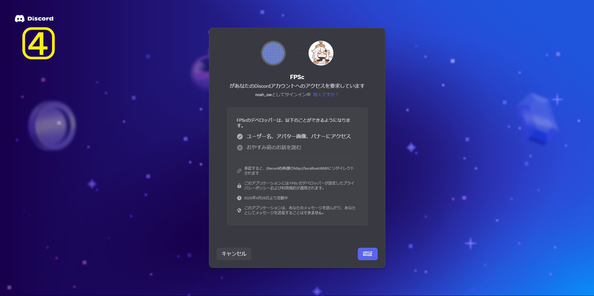

# FPSc


## 🎮 概要

**FPSc（エフピーエスシー）** は、Discord 認証を利用した **FPSプレイヤー向けのフレンド募集掲示板サイト** です。  
従来のDiscordフレンド募集サイトでは、毎回Discord IDや募集メッセージを投稿し直す必要があり、古い投稿はすぐに新しい投稿に埋もれてしまいます。さらに、ユーザーを検索する機能も備わっていませんでした。  
そこで、もっと手軽に使えて、しかも検索機能を備えたフレンド募集サイトがあったら便利だと考え、本サイトを開発しました。

> ⚠️ ご利用によって発生したトラブルなどについては、一切の責任を負いかねます。

## 🌐 VPSで閲覧する方法

このサイトはConohaのVPSで公開されています。
以下のURLからアクセスできます

```
htpps://test.com
```

## 🌟 このプロジェクトで実現したかったこと

- フロントエンドとバックエンドを分離した **ヘッドレス構成**
- ユーザー体験を最優先に考えた直感的でわかりやすい UI 設計
- 複数の条件で細かく絞り込めるユーザー検索機能
- Docker を活用した本格的な開発環境構築
- **Next.js** を活かした高速かつ柔軟なフロントエンド開発

---

## 🐳 Docker Compose で起動する方法

このプロジェクトには docker-compose.yml が用意されています。
以下のコマンドを実行すると、アプリケーションが http://localhost:3000 で起動します。

```bash
docker compose up
```

起動後、ブラウザで以下にアクセスしてください：

```
http://localhost:3000
```

## 🛠 ローカル環境で開発・編集する方法

Docker を使わずに、直接ローカル環境で開発する場合は以下の手順です。

```bash
git clone https://github.com/NOAH-git-0315/FPSc.git
cd Fpsc-main
```

### 2.フロントエンド(next.js)のセットアップ

- 依存関係をインストール

```bash
cd frontend
npm install
```

- フロントエンドの起動

```bash
npm run dev
```

### 3.バックエンド(spring-boot)のセットアップ

- 依存関係をインストール

```bash
cd backend
mvn clean install
```

- バックエンドの起動

```bash
mvn spring-boot:run
```

- 起動後、ブラウザで以下にアクセスしてください

```
http://localhost:3000
```

---

## 📁 ディレクトリ構成

※主要なものに限定しています

``` 
FPSc-main/
├ frontend/src/
│ ┝ app/
│ │ ├ deletetimeout/ profileでアカウント削除時の処理待機画面
│ │ ├ profile/ プロフィールの編集ページ
│ │ ├ layout.tsx レイアウト
│ │ ├ page.tsx トップページのページファイル
│ │ ├ standard.ts muiの共通collar、marginファイル
│ │ ├ style.scss 殆ど使っていない
│ │ └ type.ts 基本的な型定義
│ │
│ ┝ component/
│ │ ├ context/ Contextのproviderコンポーネント
│ │ ├ search/ 検索欄のUIコンポーネント
│ │ ├ main/ メニュー、トップページのUIコンポーネント
│ │ ├ profile/ プロフィール設定ページのUIコンポーネント
│ │ └ profcard.tsx　Discordユーザーカードのコンポーネント
│ │
│ lib/
│ ├ Arry/ ゲーム、ランク、プレイスタイルなどの配列
│ ├ FriendSearchAPI.ts 検索時のフェッチ及び情報の前処理の関数
│ ├ lastLogin.ts　最後のログイン時間をフェッチする関数
│ └ validation.ts ユーザープロフィール編集のバリデーション
│
├ backend/src/main/java
│ ├ controller/ コントローラー層
│ ├ dto/ dto全般
│ ├ entity/ entity層
│ ├ repository/ repository層
│ ├ security/　セキュリティーファイル
│ ├ service/　サービス層
│ └ FPScAPPlication.java　アプリケーションの設定全般のファイル
├ data.sql テストデーターです。偽のユーザーデータ
└ docker-compose.tyml コンポーズファイル
``` 

---

## 🚀 技術スタック

### 🔹 フロントエンド

- 開発言語: `node:18.17.0-alpine`
- フレームワーク: [Next.js](https://nextjs.org/)（App Router + CSR/SSR）
- UI設計: MUI（Material-UI） / TypeScript
- 認証: Discord OAuth2

### 🔸 バックエンド（参考）

- 開発言語: `openjdk:21-slim`（21）
- フレームワーク: Spring Boot **3.4.4**
- API: REST

### 🧱 インフラ・その他

- データベース: MySQL
- 環境構築: Docker / docker-compose
- バージョン管理: Git / GitHub

### 🛄 ER図


---

## 🖥️ 画面操作について

|  |  |
| ----------------- | ----------------- |
|  |  |

- ①: ユーザーカード一覧（1⃣＆2⃣ページ）が表示されます（/）
- ②: 未実装。今後サーバー一覧を表示予定（/server）
- ③: ログイン中はプロフィール編集ページを表示(3⃣ページ)、未ログイン時はDiscordのOAuth認証ページ(4⃣ページ)にリダイレクト（/profile）
- ④: 自分のユーザーカードの表示順位を上昇させます（㋐部分が「たった今」に変わります）
- ⑤: ログイン中はDiscordのアイコンを表示（/profile）
- ⑥: ユーザーカード一覧のページを切り替えます。取得したカード数に応じてページ数が変動
- ⑦: 詳細検索。ゲーム、ランク、プレイスタイル、プレイ時間などで絞り込み可能。パラメータ変更後、自動でバックエンドから再フェッチ
- ⑧: 各ユーザーのフレンド募集用カード。㋐は表示順位アップからの経過時間、㋑はアニメーション付きで詳細展開、㋒はフレンド申請用IDをクリップボードにコピー
- ⑨: チェックを入れると、自分のユーザーカードを公開
- ⑩: プロフィール編集の変更を反映
- ⑪: アカウントを削除

---

## 🔆 今後実装予定の機能

- introductionテキストのキーワード検索
- お気に入りユーザー機能
- 「IDをコピー」ボタン押下時のアニメーション追加
- サーバー募集機能
- Google広告の導入

---
